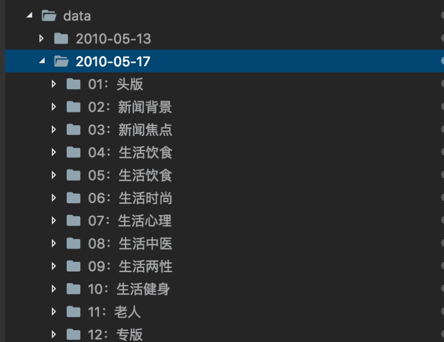

# 一个简单的程序


## Basic

首先安装git，如果装了brew

```
git clone https://github.com/h12345jack/health-yr.git
```
然后cd到目录下

```
cd health-yr
```

update新的代码

```
git pull
```


## 项目相关 

首先把数据解压到data文件夹下,得到如下的数据安放：



然后安装相关库

```
pip3 install -r requirements.txt -i  https://pypi.tuna.tsinghua.edu.cn/simple/
```

然后运行
```
python3 handle_data.py
```
如果要重新切词，（默认不切词，花时间)

```
python3 handle_data.py -w 1
```

如果要指定话题数(如：5),默认10

```
python3 handle_data.py -n 5
```

如果要不带pos进行lda，
```
python3 handle_data.py -f 0
```
